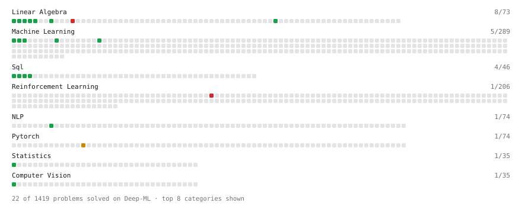

# Deep-ML

My machine learning practice from [Deep-ML](https://www.deep-ml.com). Every solution here was written by hand.

**28** solved · 26 problems · 0 labs · 2 math

[**Browse the interactive portfolio**](https://yogesh6007.github.io/deep-ml/) to replay this filling in over time.

## Problems

| | Difficulty | Solved | |
| --- | --- | --- | --- |
| [Calculate 2x2 Matrix Inverse](https://www.deep-ml.com/problems/8) | easy | 2026-09-01 | [solution](problems/0008-calculate-2x2-matrix-inverse) |
| [Calculate Covariance Matrix](https://www.deep-ml.com/problems/10) | easy | 2026-09-01 | [solution](problems/0010-calculate-covariance-matrix) |
| [Calculate Image Brightness](https://www.deep-ml.com/problems/70) | easy | 2026-09-01 | [solution](problems/0070-calculate-image-brightness) |
| [Calculate Mean by Row or Column](https://www.deep-ml.com/problems/4) | easy | 2026-09-01 | [solution](problems/0004-calculate-mean-by-row-or-column) |
| [Calculate Perplexity for Language Models](https://www.deep-ml.com/problems/320) | easy | 2026-09-05 | [solution](problems/0320-calculate-perplexity-for-language-models) |
| [Feature Scaling Implementation](https://www.deep-ml.com/problems/16) | easy | 2026-09-04 | [solution](problems/0016-feature-scaling-implementation) |
| [Filter rows with WHERE](https://www.deep-ml.com/problems/1103) | easy | 2026-09-04 | [solution](problems/1103-filter-rows-with-where) |
| [Implement Global Average Pooling](https://www.deep-ml.com/problems/114) | easy | 2026-09-08 | [solution](problems/0114-implement-global-average-pooling) |
| [Implement Ridge Regression Loss Function](https://www.deep-ml.com/problems/43) | easy | 2026-09-06 | [solution](problems/0043-implement-ridge-regression-loss-function) |
| [Label Encoding for Ordinal Variables](https://www.deep-ml.com/problems/356) | easy | 2026-09-11 | [solution](problems/0356-label-encoding-for-ordinal-variables) |
| [Linear Regression Using Gradient Descent](https://www.deep-ml.com/problems/15) | easy | 2026-09-03 | [solution](problems/0015-linear-regression-using-gradient-descent) |
| [Linear Regression Using Normal Equation](https://www.deep-ml.com/problems/14) | easy | 2026-08-30 | [solution](problems/0014-linear-regression-using-normal-equation) |
| [Matrix-Vector Dot Product](https://www.deep-ml.com/problems/1) | easy | 2026-07-18 | [solution](problems/0001-matrix-vector-dot-product) |
| [Random Shuffle of Dataset](https://www.deep-ml.com/problems/29) | easy | 2026-09-05 | [solution](problems/0029-random-shuffle-of-dataset) |
| [Reshape Matrix](https://www.deep-ml.com/problems/3) | easy | 2026-08-24 | [solution](problems/0003-reshape-matrix) |
| [Row-Normalize a Count Matrix to Probabilities](https://www.deep-ml.com/problems/985) | easy | 2026-09-03 | [solution](problems/0985-row-normalize-a-count-matrix-to-probabilities) |
| [Scalar Multiplication of a Matrix](https://www.deep-ml.com/problems/5) | easy | 2026-08-25 | [solution](problems/0005-scalar-multiplication-of-a-matrix) |
| [SELECT all rows](https://www.deep-ml.com/problems/1101) | easy | 2026-09-01 | [solution](problems/1101-select-all-rows) |
| [Select specific columns](https://www.deep-ml.com/problems/1102) | easy | 2026-09-01 | [solution](problems/1102-select-specific-columns) |
| [Sort results with ORDER BY](https://www.deep-ml.com/problems/1104) | easy | 2026-09-04 | [solution](problems/1104-sort-results-with-order-by) |
| [Transpose of a Matrix](https://www.deep-ml.com/problems/2) | easy | 2026-07-18 | [solution](problems/0002-transpose-of-a-matrix) |
| [Calculate Eigenvalues of a Matrix](https://www.deep-ml.com/problems/6) | medium | 2026-09-10 | [solution](problems/0006-calculate-eigenvalues-of-a-matrix) |
| [Implement BatchNorm2d from Scratch (training mode)](https://www.deep-ml.com/problems/902) | medium | 2026-09-07 | [solution](problems/0902-implement-batchnorm2d-from-scratch-training-mode) |
| [Sigmoidal Accuracy-to-Log-Likelihood Scaling Law Fit](https://www.deep-ml.com/problems/790) | medium | 2026-09-09 | [solution](problems/0790-sigmoidal-accuracy-to-log-likelihood-scaling-law-fit) |
| [Determinant of a 4x4 Matrix using Laplace's Expansion (hard)](https://www.deep-ml.com/problems/13) | hard | 2026-08-26 | [solution](problems/0013-determinant-of-a-4x4-matrix-using-laplace-s-expansion-hard) |
| [Off-Policy Monte Carlo Control with Weighted Importance Sampling](https://www.deep-ml.com/problems/474) | hard | 2026-09-06 | [solution](problems/0474-off-policy-monte-carlo-control-with-weighted-importance-sampling) |

## Math

| | Difficulty | Solved | |
| --- | --- | --- | --- |
| [Matrix Basics](https://www.deep-ml.com/math-problems/9) | easy | 2026-08-24 | [solution](math/0009-matrix-basics) |
| [Vector Operations](https://www.deep-ml.com/math-problems/7) | easy | 2026-08-24 | [solution](math/0007-vector-operations) |

---

_This file is regenerated by Deep-ML on every push._
